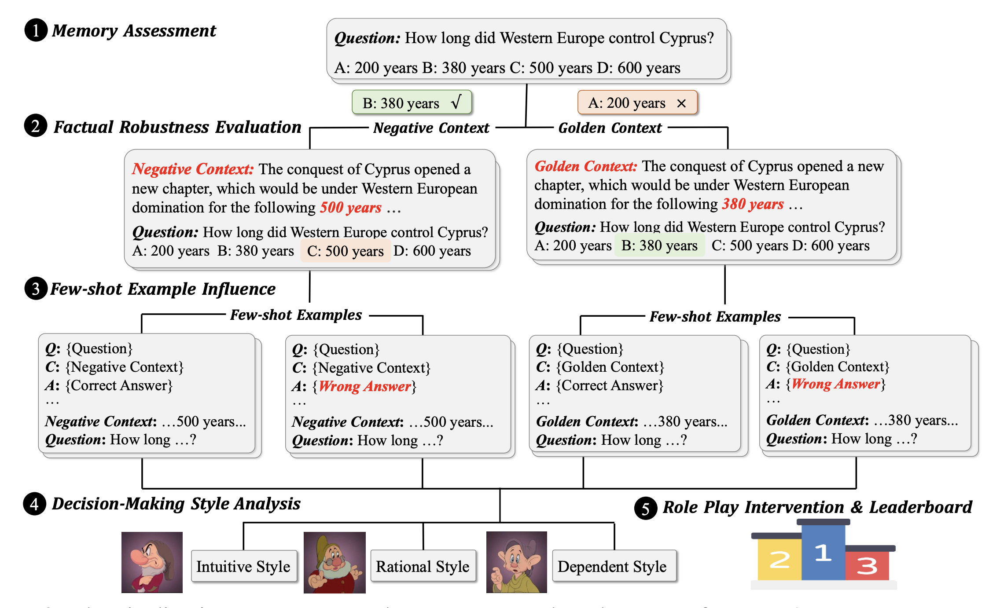
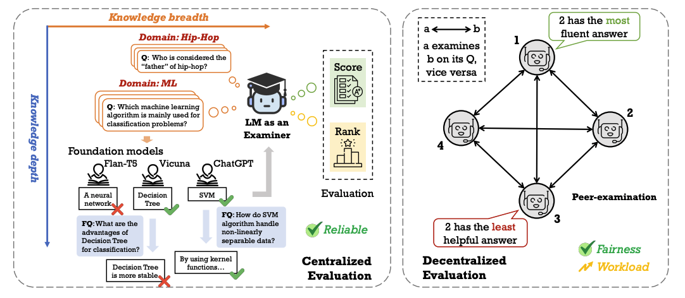

<h2 id="publications" style="margin: 2px 0px -15px;">Publications</h2>

<ol class="bibliography">



<li>

  

    <!-- You can replace 'image-link.jpg' with the actual image link if available -->
    
    <!-- Conference abbreviation if applicable -->
    <abbr class="badge">ACL</abbr>
  

  

      <!-- Link to the PDF of the paper -->
      
<a href="https://aclanthology.org/2024.acl-long.232.pdf">Intuitive or Dependent? Investigating LLMs’ Behavior Style to Conflicting Prompts</a>

      <!-- List of authors -->
      
<strong>Jiahao Ying</strong>, Yixin Cao, Kai Xiong, Yidong He, Long Cui, Yongbin Liu

      <!-- Conference full name -->
      
<em>Meeting of the Association for Computational Linguistics (ACL) 2024</em>

    

      <!-- PDF link -->
      <a href="https://aclanthology.org/2024.acl-long.232.pdf" class="btn btn-sm z-depth-0" role="button" target="_blank" style="font-size:12px;">PDF</a>
      <!-- Links for code, project page, BibTex if available -->
      <a href="https://github.com/yingjiahao14/KRE" class="btn btn-sm z-depth-0" role="button" target="_blank" style="font-size:12px;">Code</a>
      <a href="link-to-page" class="btn btn-sm z-depth-0" role="button" target="_blank" style="font-size:12px;">Project Page</a>
      <a href="link-to-bibtex" class="btn btn-sm z-depth-0" role="button" target="_blank" style="font-size:12px;">BibTex</a>
      <!-- Optional notes or other links -->
      <strong> <i style="color:#e74d3c">Main</i></strong>
    

  

</li>
 

<li>

  

    <!-- You can replace 'image-link.jpg' with the actual image link if available -->
    
    <!-- Conference abbreviation if applicable -->
    <abbr class="badge">NeurIPS</abbr>
  

  

      <!-- Link to the PDF of the paper -->
      
<a href="https://proceedings.neurips.cc/paper_files/paper/2023/hash/f64e55d03e2fe61aa4114e49cb654acb-Abstract-Datasets_and_Benchmarks.html">Benchmarking Foundation Models with Language-Model-as-an-Examiner</a>

      <!-- List of authors -->
      
Yushi Bai*, <strong>Jiahao Ying*</strong>, Yixin Cao, Xin Lv, Yuze He, Xiaozhi Wang, Jifan Yu, Kaisheng Zeng, Yijia Xiao, Haozhe Lyu, Jiayin Zhang, Juanzi Li, Lei Hou

      <!-- Conference full name -->
      
<em>Conference on Neural Information Processing Systems (NeurIPS) 2024</em>

    

      <!-- PDF link -->
      <a href="https://proceedings.neurips.cc/paper_files/paper/2023/hash/f64e55d03e2fe61aa4114e49cb654acb-Abstract-Datasets_and_Benchmarks.html" class="btn btn-sm z-depth-0" role="button" target="_blank" style="font-size:12px;">PDF</a>
      <!-- Links for code, project page, BibTex if available -->
      <a href="link-to-code" class="btn btn-sm z-depth-0" role="button" target="_blank" style="font-size:12px;">Code</a>
      <a href="https://lmexam.com/" class="btn btn-sm z-depth-0" role="button" target="_blank" style="font-size:12px;">Project Page</a>
      <a href="link-to-bibtex" class="btn btn-sm z-depth-0" role="button" target="_blank" style="font-size:12px;">BibTex</a>
      <!-- Optional notes or other links -->
      <strong> <i style="color:#e74d3c">Poster</i></strong>
    

  

</li>
 



</ol>

